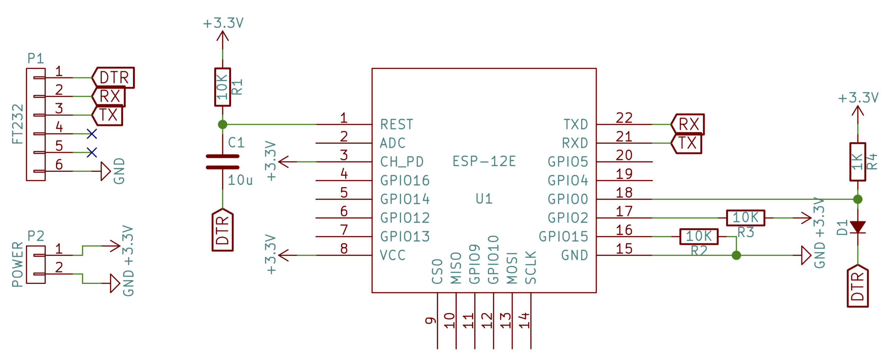

# esp-open-sdk-docker
This project contains a docker container for the ESP8266 SoC SDK. The goal is to use this container as a base for any ESP8266 project. It builds the whole toolchain by shamelessly cloning & executing the integration scripts as provided here: https://github.com/pfalcon/esp-open-sdk

To use it make sure you have installed docker and just run docker-build.

